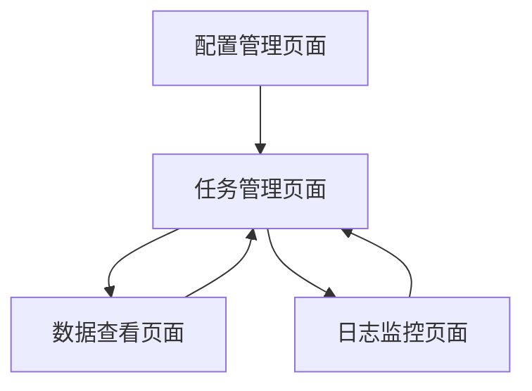

# Apify数据集成项目需求文档

## 1. 产品概述

本项目是一个基于Python的数据集成工具，用于与Apify平台对接获取各类网络爬虫数据。
- 主要目的：通过Apify API获取和处理网络爬虫数据，为业务分析提供数据支持。
- 目标用户：数据分析师、开发人员和需要网络数据的业务团队。
- 市场价值：提供高效、稳定的数据获取和处理能力，降低数据获取成本。

## 2. 核心功能

### 2.1 用户角色

| 角色 | 注册方式 | 核心权限 |
|------|----------|----------|
| 默认用户 | 直接使用 | 可以配置API密钥、运行数据获取任务、查看数据结果 |

### 2.2 功能模块

本项目包含以下主要页面：
1. **配置管理页面**：API密钥配置、Apify Actor配置、数据源设置
2. **任务管理页面**：创建数据获取任务、任务状态监控、任务历史记录
3. **数据查看页面**：数据预览、数据导出、数据统计分析
4. **日志监控页面**：系统日志、错误日志、性能监控

### 2.3 页面详情

| 页面名称 | 模块名称 | 功能描述 |
|----------|----------|----------|
| 配置管理页面 | API配置模块 | 设置Apify API Token、配置默认参数、测试连接状态 |
| 配置管理页面 | Actor配置模块 | 选择和配置Apify Actor、设置运行参数、保存配置模板 |
| 任务管理页面 | 任务创建模块 | 创建新的数据获取任务、设置任务参数、选择数据源 |
| 任务管理页面 | 任务监控模块 | 实时查看任务状态、显示进度信息、支持任务暂停和停止 |
| 任务管理页面 | 历史记录模块 | 查看历史任务列表、任务详情、重新运行任务 |
| 数据查看页面 | 数据预览模块 | 显示获取的数据、支持分页浏览、数据格式化展示 |
| 数据查看页面 | 数据导出模块 | 导出为CSV/JSON格式、批量下载、数据过滤 |
| 数据查看页面 | 统计分析模块 | 数据量统计、成功率分析、趋势图表 |
| 日志监控页面 | 系统日志模块 | 显示系统运行日志、日志级别过滤、日志搜索 |
| 日志监控页面 | 错误监控模块 | 错误日志展示、错误统计、告警通知 |

## 3. 核心流程

用户首先在配置管理页面设置Apify API Token和选择需要的Actor，然后在任务管理页面创建数据获取任务并监控执行状态，最后在数据查看页面预览和导出获取的数据。如果出现问题，可以在日志监控页面查看详细的错误信息。

## 4. 用户界面设计

### 4.1 设计风格

- 主色调：深蓝色(#1e3a8a)和浅蓝色(#3b82f6)
- 辅助色：灰色(#6b7280)和绿色(#10b981)
- 按钮样式：圆角按钮，带有轻微阴影效果
- 字体：系统默认字体，标题16px，正文14px，小字12px
- 布局风格：卡片式布局，左侧导航栏，顶部状态栏
- 图标风格：简洁的线性图标，支持状态指示

### 4.2 页面设计概览

| 页面名称 | 模块名称 | UI元素 |
|----------|----------|--------|
| 配置管理页面 | API配置模块 | 输入框用于API Token、测试按钮、状态指示灯、保存按钮 |
| 配置管理页面 | Actor配置模块 | 下拉选择框、参数配置表单、预览区域、模板保存功能 |
| 任务管理页面 | 任务创建模块 | 表单输入、Actor选择器、参数配置面板、创建按钮 |
| 任务管理页面 | 任务监控模块 | 任务列表表格、状态标签、进度条、操作按钮组 |
| 数据查看页面 | 数据预览模块 | 数据表格、分页控件、搜索框、列排序功能 |
| 数据查看页面 | 数据导出模块 | 格式选择、导出按钮、下载进度、批量操作 |
| 日志监控页面 | 系统日志模块 | 日志列表、时间筛选、级别过滤、搜索功能 |

### 4.3 响应式设计

桌面优先设计，支持移动端适配，考虑触摸交互优化，在小屏幕设备上采用折叠式导航。